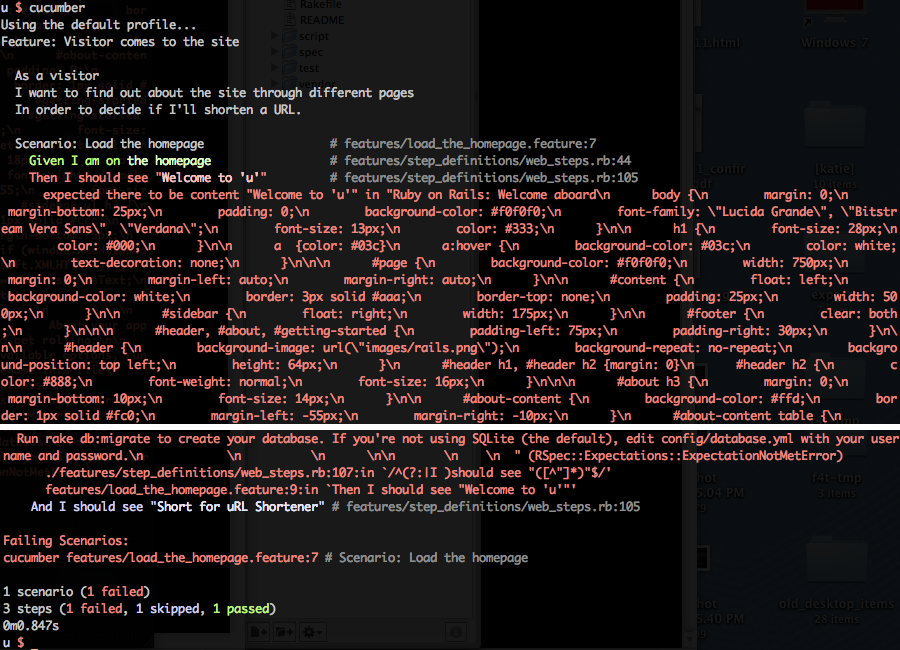

<!SLIDE code transition=zoom>
## Initialize Test Suite ##

Setup our test suite with a few simple commands:

    @@@sh
    # Setup Cucumber
    $ rails generate cucumber:install
    # Setup RSpec
    $ rails generate rspec:install

  
Facilitated by: Booz, Allen, Hamilton | Presented by: <a href="http://twitter.com/stevenhaddox">@stevenhaddox</a>

<!SLIDE code transition=uncover>
## Cucumber Feature ##

The very first thing a visitor does is load the homepage:

    @@@Ruby
    #u/features/load_the_homepage.feature
    Feature: Visitor comes to the site

      As a visitor
      I want to find out about the site through different pages
      In order to decide if I'll shorten a URL. 

      Scenario: Load the homepage
        Given I am on the homepage
        Then I should see "Welcome to 'u'"
        And I should see "Short for uRL Shortener"

  
Facilitated by: Booz, Allen, Hamilton | Presented by: <a href="http://twitter.com/stevenhaddox">@stevenhaddox</a>

<!SLIDE center transition=uncover>
### Run the scenario ###

  
Facilitated by: Booz, Allen, Hamilton | Presented by: <a href="http://twitter.com/stevenhaddox">@stevenhaddox</a>

<!SLIDE small transition=uncover>
# FAIL #

Why did it fail? I thought this was supposed to be easy?!

Failing early is good, but it looks like there's already content on the homepage when it tried to scan for the text we expected.  Let's investigate it by loading the application ourselves & see what's there.

    @@@sh
    $ rails s

Then navigate to: http://localhost:3000

  
Facilitated by: Booz, Allen, Hamilton | Presented by: <a href="http://twitter.com/stevenhaddox">@stevenhaddox</a>

