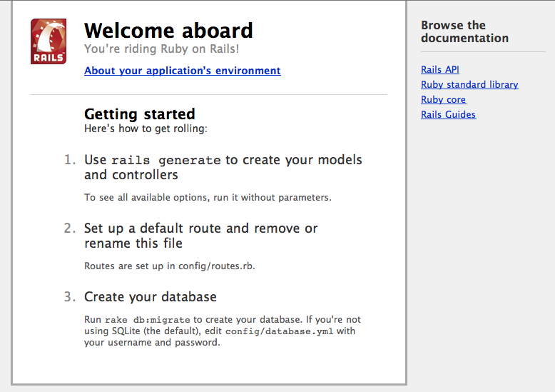

<!SLIDE code transition=zoom>
## Initialize Test Suite ##

Setup our test suite with a few simple commands:

    @@@sh
    # Setup Cucumber
    $ rails generate cucumber:install
    # Setup RSpec
    $ rails generate rspec:install

  
Facilitated by: Booz, Allen, Hamilton | Presented by: <a href="http://twitter.com/stevenhaddox">@stevenhaddox</a>

<!SLIDE code transition=uncover>
## Cucumber Feature ##

The very first thing a visitor does is load the homepage:

    @@@cucumber
    #u/features/load_the_homepage.feature
    Feature: Visitor comes to the site

      As a visitor
      I want to find out about the site through different pages
      In order to decide if I'll shorten a URL. 

      Scenario: Load the homepage
        Given I am on the homepage
        Then I should see "Welcome to 'u'"
        And I should see "Short for uRL Shortener"

  
Facilitated by: Booz, Allen, Hamilton | Presented by: <a href="http://twitter.com/stevenhaddox">@stevenhaddox</a>

<!SLIDE center transition=uncover>
### Run the scenario ###

  
Facilitated by: Booz, Allen, Hamilton | Presented by: <a href="http://twitter.com/stevenhaddox">@stevenhaddox</a>

<!SLIDE small transition=uncover>
# FAIL #

Why did it fail? I thought this was supposed to be easy?!

Failing early is good, but it looks like there's already content on the homepage when it tried to scan for the text we expected.  Let's investigate it by loading the application ourselves & see what's there.

    @@@sh
    $ rails s

Then navigate to: http://localhost:3000

  
Facilitated by: Booz, Allen, Hamilton | Presented by: <a href="http://twitter.com/stevenhaddox">@stevenhaddox</a>

<!SLIDE small transition=uncover>
# Do'h!!! #

Easy fix, simply delete the index.html file with:

    @@@sh
    $ rm public/index.html

Then rerun our cucumber suite and get the following results:

    @@@cucumber
    $ cucumber
    Using the default profile...
    Feature: Visitor comes to the site

      As a visitor
      I want to find out about the site through different pages
      In order to decide if I'll shorten a URL.

      Scenario: Load the homepage                  # features/01-load_the_homepage.feature:7
        Given I am on the homepage                 # features/step_definitions/web_steps.rb:44
          No route matches "/" (ActionController::RoutingError)
          <internal:prelude>:10:in `synchronize'
          ./features/step_definitions/web_steps.rb:45:in `/^(?:|I )am on (.+)$/'
          features/01-load_the_homepage.feature:8:in `Given I am on the homepage'
        Then I should see "Welcome to 'u'"         # features/step_definitions/web_steps.rb:105
        And I should see "Short for uRL Shortener" # features/step_definitions/web_steps.rb:105

    Failing Scenarios:
    cucumber features/01-load_the_homepage.feature:7 # Scenario: Load the homepage

    1 scenario (1 failed)
    3 steps (1 failed, 2 skipped)
    0m5.726s

  
Facilitated by: Booz, Allen, Hamilton | Presented by: <a href="http://twitter.com/stevenhaddox">@stevenhaddox</a>

<!SLIDE small transition=uncover>
# Routes #

    @@@sh
    No route matches "/" (ActionController::RoutingError)

The error above indicates that we have not told our Rails application what to load on the homepage.

Since we only want static HTML for the homepage we can implement Thoughtbot's HighVoltage gem to save us some work.

Add it to your Gemfile & install it in two lines:

    @@@sh
    #u/Gemfile
    gem "high_voltage"
    
    $ bundle install

This gives us some free routes as well as allows us free controller logic that renders static *.html.erb files from:

    @@@sh
    app/views/pages/

  
Facilitated by: Booz, Allen, Hamilton | Presented by: <a href="http://twitter.com/stevenhaddox">@stevenhaddox</a>

<!SLIDE small transition=uncover>
## View Error ##

Although we get free routes for our "pages" with HighVoltage, we don't get a free homepage route. Let's add ours:

    @@@ruby
    #u/config/routes.rb
    root :to => 'high_voltage/pages#show', :id => 'home'

Rerun cucumber now that we have our route defined:

    @@@cucumber
    $ cucumber
    Using the default profile...
    Feature: Visitor comes to the site

      As a visitor
      I want to find out about the site through different pages
      In order to decide if I'll shorten a URL.

      Scenario: Load the homepage                  # features/01-load_the_homepage.feature:7
        Given I am on the homepage                 # features/step_definitions/web_steps.rb:44
          No such page: home (ActionController::RoutingError)
          <internal:prelude>:10:in `synchronize'
          ./features/step_definitions/web_steps.rb:45:in `/^(?:|I )am on (.+)$/'
          features/01-load_the_homepage.feature:8:in `Given I am on the homepage'
        Then I should see "Welcome to 'u'"         # features/step_definitions/web_steps.rb:105
        And I should see "Short for uRL Shortener" # features/step_definitions/web_steps.rb:105

    Failing Scenarios:
    cucumber features/01-load_the_homepage.feature:7 # Scenario: Load the homepage

    1 scenario (1 failed)
    3 steps (1 failed, 2 skipped)
    0m10.530s

This time we get another error:

    @@@sh
    No such page: home (ActionController::RoutingError)

  
Facilitated by: Booz, Allen, Hamilton | Presented by: <a href="http://twitter.com/stevenhaddox">@stevenhaddox</a>

<!SLIDE small transition=uncover>
## Adding our view ##

Hopefully you've seen that Cucumber is _**telling**_ us what to do.
###Easiest. Job. Ever!###

Let's add a page for "home" so that our route can display it:

    @@@ruby
    #u/app/views/pages/home.html.erb
    <h2>Welcome to 'u'</h2>
    <h3>Short for uRL Shortener</h3>

And the survey says:

    @@@cucumber
    $ cucumber
    Using the default profile...
    Feature: Visitor comes to the site

      As a visitor
      I want to find out about the site through different pages
      In order to decide if I'll shorten a URL.

      Scenario: Load the homepage                  # features/01-load_the_homepage.feature:7
        Given I am on the homepage                 # features/step_definitions/web_steps.rb:44
        Then I should see "Welcome to 'u'"         # features/step_definitions/web_steps.rb:105
        And I should see "Short for uRL Shortener" # features/step_definitions/web_steps.rb:105

    1 scenario (1 passed)
    3 steps (3 passed)
    0m6.768s

Our first scenario is now passing. Wasn't that easy?!

  
Facilitated by: Booz, Allen, Hamilton | Presented by: <a href="http://twitter.com/stevenhaddox">@stevenhaddox</a>

